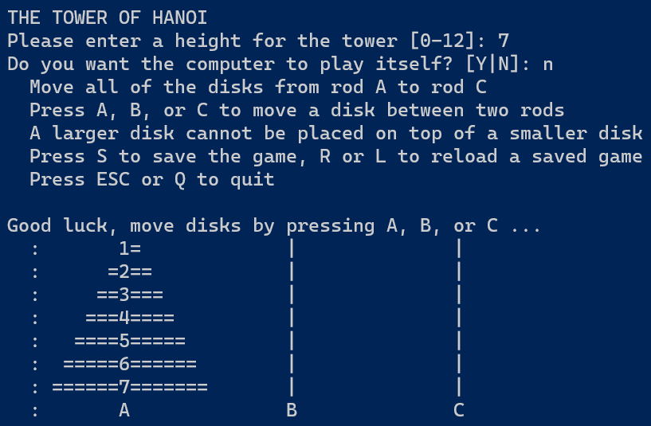
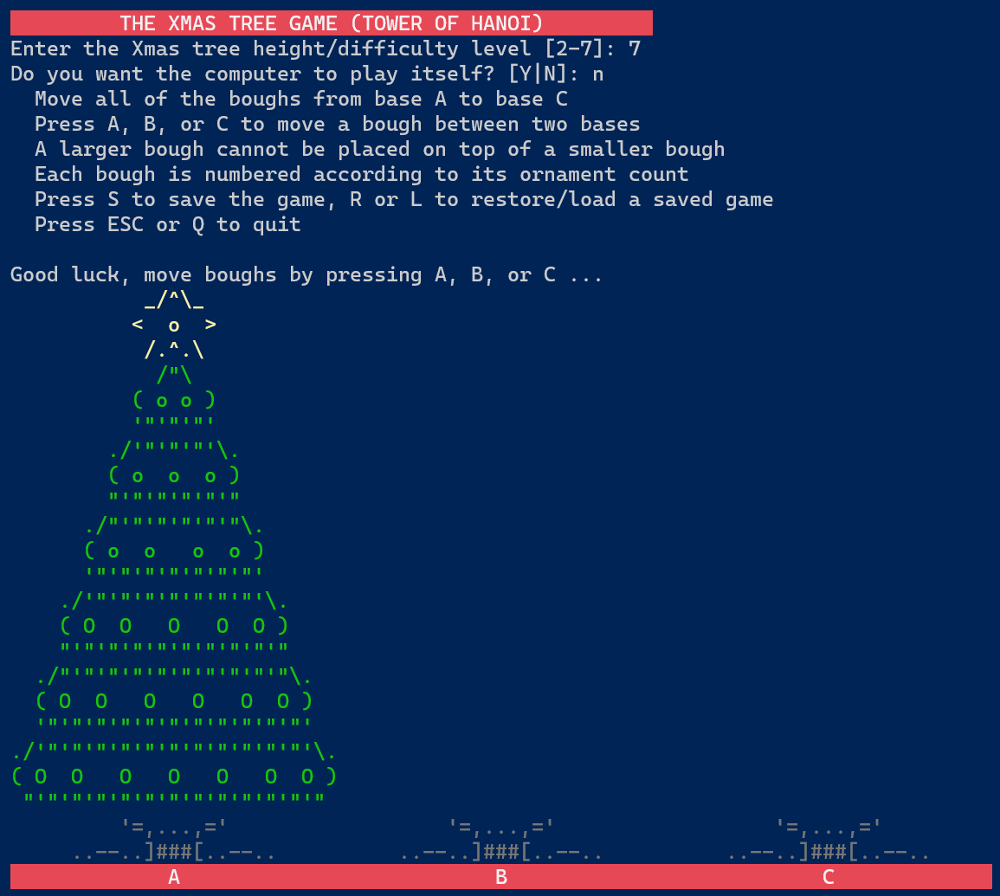

# Tower of Hanoi
## Copyright (c) 2023 TigerPointe Software, LLC

## Description
A module for playing the Tower of Hanoi puzzle game in Python or PowerShell.

* Solve the puzzle yourself
* Allow the computer to solve the puzzle
* Up to twelve levels of difficultly
* Save and reload your progress





Python requires the pynput module to capture keypress input events.

```
pip install pynput
```

```
pip3 install pynput
```

When the Python game is started, keypress input events are captured but not passed onto the system.  Save and exit the game before using other programs.

The PowerShell script MUST be started from a real console window, not an ISE, because keypress detection is used.

Unsigned downloaded PowerShell scripts need to be unblocked before use.

```
Unblock-File -Path .\Start-TowerHanoi.ps1
```

Bonus Scripts:  Holiday themed "Xmas Tree" Tower of Hanoi games for Python or PowerShell.





Please consider giving to cancer research.

## Make a Difference
If you enjoy this software, please consider donating to one of the following:

[American Cancer Society](https://www.cancer.org)

[National Brain Tumor Society](https://braintumor.org)